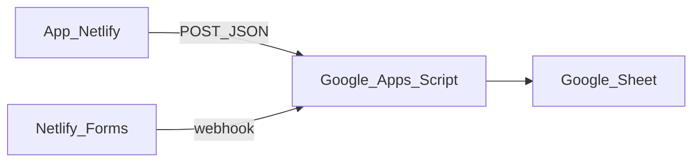

# Quản lý chi tiêu (webPayment)

Ghi chi tiêu nhóm — dữ liệu lưu trên **Google Sheets** (miễn phí, không giới hạn 24h).

## Chạy local

1. Làm theo [`google-apps-script/README.md`](google-apps-script/README.md) (tạo Sheet + Deploy Web App)
2. Copy `.env.example` → `.env`, điền `GOOGLE_SCRIPT_URL`
3. `npm install && npm run dev` → http://localhost:3000

## Deploy Netlify

1. Connect GitHub, **Publish directory** để trống hoặc `.next` trong `netlify.toml`
2. **Environment variables:**
   - `GOOGLE_SCRIPT_URL` — URL Apps Script (**secret**)
   - `NEXT_PUBLIC_GOOGLE_SHEET_URL` — link mở sheet (tùy chọn)
3. **Không cần** `DATABASE_URL` / Prisma / Netlify DB
4. Build: `npm run build`

## Luồng dữ liệu

- Thêm bill / tick đã CK → API Next.js → Apps Script → ghi Sheet
- Mở Sheet → filter, sửa, export Excel từ Google

## Tính năng

- Hôm nay, thêm chi tiêu (mức giá 40/45/50k), bộ hay đi
- Tick đã chuyển khoản
- Xem trực tiếp trên Google Sheet
